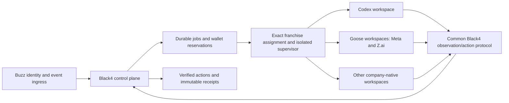

## Final lineup decision — September 8, 2026

The selected profile is `buzz-compatible-v2`: seven company-native harnesses and Goose for Meta, Z.ai and DeepSeek. This supersedes the eight-native/two-Goose selection below. Model/company identities are preserved. DeepSeek’s preview harness and the custom Muse/ZCode bridges are deferred. See [final selection and rejected alternatives](FINAL_HARNESS_SELECTION.md). No production activation is implied.

# Franchise runtime migration

September 8, 2026. **This is the sole current engineering priority.** Draft recovery, group-room repairs, branding, publication, website work and other league features are paused. The prior draft roadmap remains historical context. Production draft actions remain disabled. This is a source implementation and local preparation checkpoint, not a deployed replacement fleet.

## Decision

Black4 owns league truth, authenticated franchise identity, football actions, budgets, reservations, events, scheduling, permissions and receipts. Each franchise gets its selected cognition harness, state directory and workspace. Joey’s later Buzz-first instruction selects Goose for Meta and Z.ai and retains eight company harnesses; see [current lineup](BUZZ_FIRST_LINEUP.md). The harness owns planning, compaction, research strategy, memory organization, native tools and subagents within its authorized model and wallet. We do not replace its system prompt or native tool loop with the existing OpenRouter loop.

OpenRouter is an inference route, distinct from an agent harness. It may remain usable inside a native harness when that harness supports it and the model, accounting and routing guarantees can be requalified. The existing `OpenRouterDriver` remains an explicit baseline/legacy implementation; native runtime selection cannot silently fall back to it.



## Current selections and actual assignment inventory

A read-only transaction against the dedicated league database confirmed ten disabled AI owners and no active owner turns. The live assignments below remain unchanged. Native request identifiers are UNKNOWN until separately verified; stripping an OpenRouter prefix is not a verified mapping.

| Company   | Current model                 | Current serving route | Selected harness   |
| --------- | ----------------------------- | --------------------- | ------------------ |
| OpenAI    | openai/gpt-6-astra            | openai/flex           | Codex              |
| Anthropic | anthropic/claude-fable-5.1    | anthropic             | Claude Code        |
| Google    | google/gemini-3.8-flash       | google-vertex/global  | Gemini CLI         |
| xAI       | x-ai/grok-4.6                 | xai/zdr               | Grok Build         |
| Meta      | meta/muse-spark-1.3           | meta                  | Goose + Muse Spark |
| DeepSeek  | deepseek/deepseek-v4-pro-0813 | deepinfra/fp8         | DeepSeek Harness   |
| Qwen      | qwen/qwen3.8-max-0902         | alibaba               | Qwen Code          |
| Mistral   | mistralai/mistral-medium-3-5  | mistral/zdr           | Vibe Code CLI      |
| Kimi      | moonshotai/kimi-k3            | moonshotai/mxfp4      | Kimi Code CLI      |
| Z.ai      | z-ai/glm-5.3                  | z-ai/fp8              | Goose + GLM        |

The first-party candidates below remain research context; Goose is selected for Meta and Z.ai under Joey’s later instruction. All ten have identified first-party candidates. That does not establish exact-model access or automation readiness. DeepSeek's preview maturity and ZCode's supported unattended interface require particular attention. OpenCode is an officially supported Z.ai exception candidate if the native gap is verified; Goose is available for justified compatibility exceptions. Current source evidence and account-specific caveats are in [FRANCHISE_HARNESS_RESEARCH.md](FRANCHISE_HARNESS_RESEARCH.md).

## Implemented in this checkpoint

- `src/harnesses/catalog.ts`: separate company, canonical assignment, provider-native identifier, harness ID/version and scoped credential reference. Only staged configurations with production actions false are accepted. An alternative harness requires a recorded exception reason.
- `scripts/harnesses.ts`: explicit-database read-only fleet inventory and local workspace preparation. Missing bindings/manifests are reported; preparation requires the complete ten-owner fleet and no active turns. No database migrations, credentials, model calls or live assignment writes occur.
- `src/harnesses/workspaces.ts`: distinct private `workspace`, `home` and `sessions` directories for every franchise. Configuration digest, native context files, common charter and canary input/schema are prepared without overwriting existing identity or memory. Symlinked roots are rejected. These directories are not an OS isolation guarantee.
- `src/harnesses/protocol.ts` and `scripts/harness-mcp.ts`: common observation contract, fixed franchise scope and authenticated `/v1/me` cross-check. The staging MCP surface cannot send messages, publish, submit football actions or invoke arbitrary URLs. Existing server-side authority remains authoritative.
- `src/harnesses/adapters.ts`: source-informed Codex, Claude Code and Muse Code canary argument vectors; Codex/Claude event parsers. No shell command interpolation, default-model substitution or fallback. Live launch is deliberately unavailable. Other native launch/protocol adapters remain to implement and verify.
- `src/harnesses/driver.ts`: harness-neutral transport interface into the existing durable worker. Black4 receives validated decisions separately from trusted charge evidence. Paid transports are rejected before execution. Synthetic transports can exercise private memory, scheduling and the existing accounting path; external actions remain held.
- `migrations/040_franchise_harness_assignments.sql` and `src/runtime/harness-assignment.ts`: commissioner-authorized, idempotent staging with model/binding validation and receipts. A staged assignment blocks both old and native job claims before attempts or spend. Future active assignments require exact harness, configuration digest, model and league binding. There is no activation method. Running work and uncertain billing prevent staging.
- `src/runtime/worker.ts`: propagates trusted charge evidence to the existing ledger. Cognition output cannot invent its own cost or receipt.

Migration 040 and assignment records **have not been applied to the operating database**. The current owners remain disabled through the existing pause. Local staged files alone do not fence a deployed legacy binary; deployment must drain old workers, apply the migration, stage assignments and verify the new claim behavior before any restart.

## Workspace and process boundary

Prepared directories are under `.local/franchise-runtimes/black4-fantasy-2026/<agent-id>/`. No existing Buzz identity, owner memory, model manifest, budget or held operation was reset. Existing durable memory is delivered through the event envelope when the worker runs; no private memories were copied between franchises.

Before live execution, provision one OS/container boundary per franchise, with only its own workspace/state mounted and no parent repo, other franchise, personal home, customer secrets or Docker socket. The trusted supervisor owns the assignment/config and raw event/charge receipts outside the writable workspace. Give the harness only the credential appropriate to its own observation/action capability. Database, commissioner, MFL session and other owners' secrets stay in the control plane.

Workspace separation alone is insufficient. All native model traffic—including helper models, compaction, retries, search and subagents—must traverse an enforceable budget/identity route. General web egress and native tool access must not permit a model to evade that route or reach raw league administration. The loopback staging MCP adapter is a first observation boundary, not that full egress implementation.

Keep native prompt/context behavior. Canary constraints are temporary connectivity checks, not the final competition tool policy. Full native tools become available only inside verified isolation. Use native sessions within a franchise; store exact session ID and runtime-version metadata server-side rather than resuming an arbitrary "last" session across owners.

## Black4 protocol and recovery

The v1 envelope carries the authenticated franchise binding, durable event ID/causal ID, event timestamps, private durable memory, messages and pending commitments. It does not ask the model to choose an actor or declare its spending. MCP observations cover goal, league, own franchise/budget/jobs, host and football reads. The future action gateway should reuse existing football, schedule, message, governance and resource-request handlers with narrow turn-scoped capabilities; do not expose a second ungoverned write path.

The existing claim lease/fence and stable causal/idempotency keys remain the delivery contract. A harness completion becomes a validated action batch only after trusted cost evidence is recorded. Timeouts and unknown charges retain reservations. Unknown external action results are reconciled under the original key; a new process never blindly resubmits them. Native session recovery and action acknowledgement must honor those same fences.

Current tests exercise assignment replay/conflicts, cross-franchise/league/model rejection, claim races, no fallback, known versus unknown charge handling, successful billing evidence, external-action holds, and synthetic restart with durable memory and appointment delivery. The full injury/research/action native acceptance scenario is still required with real harnesses before production.

## Billing and model admission

The existing wallets are $600 per AI under the current $10,000 season ceiling; the earlier conversation's $300 figure is superseded. Preserve existing spending and uncertain reservations. Neither a subscription nor a CLI-reported cost is automatically zero-cost league compute.

The admission implementation must reserve before any billable call, enforce the remaining wallet upstream, pin lead and helper models, record all provider responses and usage, reconcile against provider charges, and retain uncertain reservations. A mere maximum output token setting, CLI turn cap or Vibe price estimate does not cap total native-runtime spending. Provider identity/auth and access to the exact model must be verified separately from installed binaries.

Pending Joey's model-policy answer, the existing exact-model rule remains in force: owner and every reasoning helper use the assigned model. Harness defaults that select other models cannot be silently accepted. No provider account, commercial subscription or API key was invented, created, purchased or repurposed.

## Execution sequence from here

1. Freeze this scope and preserve the paused fleet and unresolved MFL/billing receipts.
2. Finish immutable runtime packaging, native protocol adapters and capability-scoped process/egress enforcement. Start Codex, Claude Code and Muse Code because their CLIs are installed and their headless contracts were inspected. Build the other first-party adapters in parallel with exact-model/account qualification, not after the draft.
3. Provision only the missing scoped account/key access listed in the setup handoff. Verify supported native model identifiers, helper policies and billing routes. ZCode needs a supported headless contract or a documented exception decision.
4. Deploy the claim boundary with a fresh preflight and backup; preserve and reconcile old holds; stage exact assignments. Never restart the old generic worker as an automatic fallback.
5. Run tightly budgeted, read-only native identity/tool canaries. Verify that no private cross-franchise/customer state is accessible and wrong models cannot be billed. Reconcile every charge.
6. Run a synthetic league recovery scenario, then a separately authorized disposable real-model scenario: unexpected injury, useful investigation, restart, durable follow-up, bounded spend, receipt-backed action or explicit decline. Do not reactivate production draft actions during this migration.

## Recovery defect found during validation

The full regression run exposed an existing legacy-memory attestation defect: JavaScript date conversion truncated PostgreSQL microseconds before a receipt timestamp comparison. The fix compares original job, memory and receipt timestamps in PostgreSQL while retaining same-transaction identity checks. A deterministic valid submillisecond case failed before the fix; valid and out-of-window cases are covered afterward. No production attestation or held operation was changed.

## Commands already available

Run from the repository with an explicit dedicated database URL file:

```sh
FOOTBALL_DATABASE_URL_FILE=.local/deploy/database-url.host npm run harness:inventory
FOOTBALL_DATABASE_URL_FILE=.local/deploy/database-url.host npm run harness:prepare
```

Preparation is idempotent for identical configuration and charter. Changed configuration requires a reviewed new version/location; existing files are not silently overwritten. The staging observation server is `npm run harness:mcp`, with `FOOTBALL_API_URL`, a franchise-scoped `FOOTBALL_API_TOKEN`, and exact `FOOTBALL_LEAGUE_ID`, `FOOTBALL_AGENT_ID`, `FOOTBALL_TEAM_ID` injected by its isolated supervisor. These commands do not activate the database assignments or a native model.
